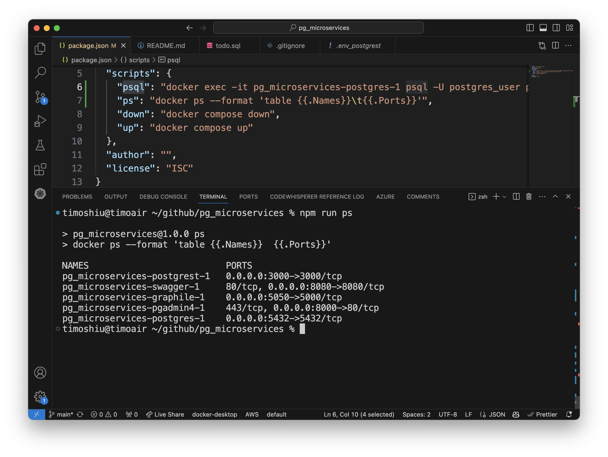

# Starting microservices
This microservices is composed of 1. pgAdmin4 over the localhost, 2. swagger for restful openAPI, 3. postgraphile for GraphQL, and 4. postgres which is accessible by `psql`.

Here is the network layout. one can upload the file `docker-compose.excalidraw` to `https://excalidraw.com` to view or edit.


1. to start, run the following command to start all microservices
```
% # docker compose up
% npm run up

```

1. to shutdown, one can run `npm run down`
```
% # docker compose down
% npm run down
```

1. to restart, one can run `npm run restart`
```
% # docker compose restart
% npm run restart
```

# Using microservices
Once all the services are running, 
visit one of the links below for various functions.
1. visit http://localhost:8000/browser/   
   to do `CREATE TABLE`, `INSERT ...`, ...
   
1. visit http://localhost:8080/  
   to `curl -X GET ....`
   
1. visit http://localhost:5050/graphiql   
   to `query  { allTodo: { ...} }`
   
1. connect to postgres database server with `psql`, run 
   ```
   % # docker exec -it pg_microservices-postgres-1 psql -U postgres_user postgres
   % npm run psql
   ```
   1. check running microservices (docker containers)
     
   1. show all tables in the `public` schema
     
   1. select `id`, `title`, `is_done` columns from table `todo`
     
